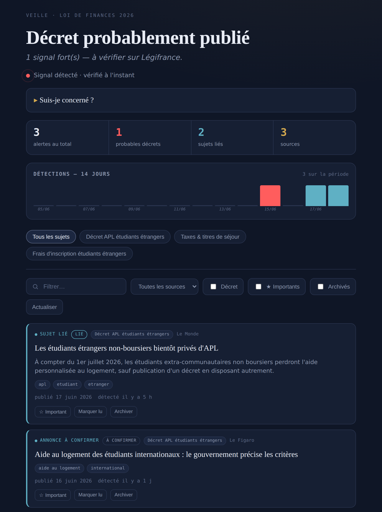

# Veille décret APL — étudiants étrangers

> Veille automatique, **sans serveur**, sur la publication du décret d'application
> de la loi de finances 2026 (art. 179, modifiant l'art. L.822-2 CCH) supprimant les
> APL des étudiants étrangers extra-communautaires non boursiers — et sur les sujets liés.

<!-- Remplacez USER/REPO par votre pseudo et le nom du repo pour activer le badge CI -->
[](https://github.com/USER/REPO/actions/workflows/ci.yml)


Au 1er juillet 2026, ~90 000 à 100 000 étudiants extra-communautaires non boursiers
perdront leur APL. Un **décret d'application** doit en préciser les modalités, et il
peut paraître à tout moment. Ce projet surveille la presse, le Journal officiel et des
pages gouvernementales, et **prévient sur Telegram dès qu'un signal apparaît** — avec un
tableau de bord qui répond d'un coup d'œil : *le décret est-il sorti ?*

## Aperçu



## Fonctionnalités

| | |
|---|---|
| **Multi-sources** | Presse (Google News), texte officiel (JORF/Légifrance), pages gouvernementales surveillées. |
| **Tri par confiance** | *confirmé · probable · à confirmer · report/suspension · lié* — gère la négation (« pas encore publié »). |
| **Dédoublonnage** | Les reprises d'une même info (même reformulées) sont regroupées : un seul ping. |
| **Intensification** | Alerte quand l'activité d'un sujet s'emballe (souvent avant la publication). |
| **Multi-sujets** | APL, taxes de séjour, frais d'inscription — onglets configurables. |
| **Push** | Telegram + ntfy.sh, plus notifications PWA. |
| **Brief quotidien IA** | Synthèse des dernières 24 h (optionnel). |
| **Suis-je concerné ?** | Verdict personnalisé selon nationalité et statut boursier. |
| **Triage** | Lu / important / archivé, mémorisé dans le navigateur. |
| **Auto-surveillance** | Battement de cœur hebdomadaire + alerte si un workflow échoue. |

## Comment ça marche

```
Google News ┐                              ┌─► Telegram / ntfy (push)
Légifrance  ┼─► monitor.py (tri local) ───┼─► docs/data.json ─► dashboard (GitHub Pages)
Pages gouv. ┘   (GitHub Actions, horaire)  └─► og.png (statut partageable)
```

Aucun serveur : la veille tourne sur **GitHub Actions** (cron horaire), le tableau de
bord est servi en statique par **GitHub Pages**. Le tri est 100 % local, sans IA, à
partir de règles éditables.

## Démarrage rapide

```bash
# 1. Bot Telegram via @BotFather  ->  TOKEN + chat ID
# 2. Repo GitHub public  ->  déposer les fichiers
# 3. Secrets : TELEGRAM_TOKEN, TELEGRAM_CHAT_ID
# 4. Actions -> « Veille decret APL » -> Run workflow
# 5. Settings -> Pages -> main /docs
```

Détails pas à pas (avec options ntfy / IA / Légifrance) : **[INSTALL.md](INSTALL.md)**.

## Stack

Python 3.12 (**bibliothèque standard uniquement**, zéro dépendance) · GitHub Actions ·
GitHub Pages · HTML/CSS/JS vanilla · API Telegram · ntfy.sh · *(optionnel)* API
Légifrance (PISTE) et API Anthropic.

## Structure du projet

```
monitor.py            veille : collecte, tri, confiance, dédoublonnage, push
legifrance.py         source officielle JORF (optionnel)
digest.py             brief quotidien IA (optionnel)
make_og.py            image de statut + icônes PWA
topics.json           sujets suivis + règles de tri
pages.json            pages officielles surveillées
test_monitor.py       tests de non-régression
docs/                 tableau de bord (PWA) servi par GitHub Pages
.github/workflows/    monitor (horaire) · digest (quotidien) · ci (tests)
```

## Documentation

- **[INSTALL.md](INSTALL.md)** — installation pas à pas.
- **[MAINTENANCE.md](MAINTENANCE.md)** — calibration, dépannage, sécurité, cycle de vie.
- **[ARCHITECTURE.md](ARCHITECTURE.md)** — fonctionnement détaillé, modèle de tri, schémas.

## Tests

```bash
python -m unittest -v     # 17 tests, aucun réseau requis
```

La CI exécute la compilation et les tests à chaque push.

## Avertissement

Projet indépendant, sans lien avec l'administration. L'outil « Suis-je concerné ? »
fournit une **estimation indicative, pas un avis juridique**. La référence fait foi :
toujours vérifier sur [Légifrance](https://www.legifrance.gouv.fr) / Journal officiel.

## Licence

[MIT](LICENSE).
